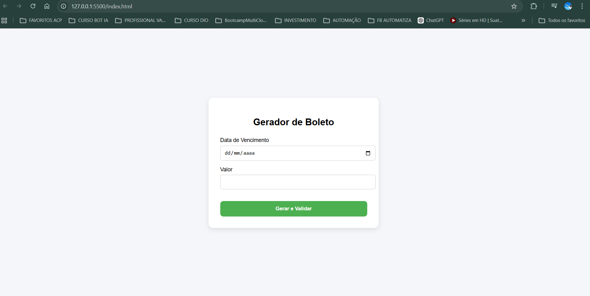
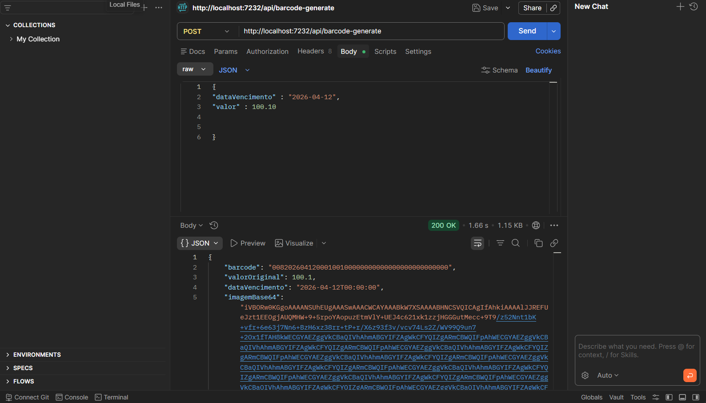
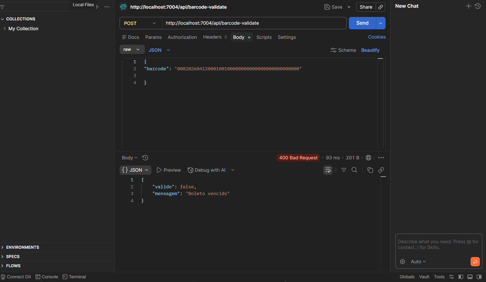
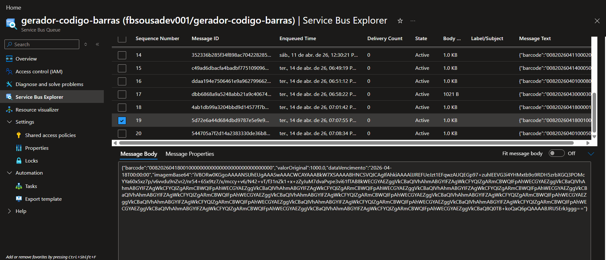

# 💳 Gerador e Validador de Boletos

Projeto desenvolvido utilizando arquitetura serverless com Azure Functions, responsável pela geração e validação de boletos simulados, incluindo integração com Azure Service Bus e interface web.

---

## 🚀 Tecnologias utilizadas

- C#
- Azure Functions
- Azure Service Bus
- JavaScript (Vanilla)
- HTML5 / CSS3
- Newtonsoft.Json
- BarcodeLib / SkiaSharp

---

## 🧠 Arquitetura do projeto

O sistema é composto por duas APIs principais:

### 🔹 1. Gerador de Boleto (`barcode-generate`)
Responsável por:
- Receber data de vencimento e valor
- Gerar código de barras com 44 dígitos
- Criar imagem do barcode em Base64
- Enviar mensagem para fila no Azure Service Bus

---

### 🔹 2. Validador de Boleto (`barcode-validate`)
Responsável por:
- Receber código de barras
- Validar estrutura (44 caracteres)
- Extrair data de vencimento
- Verificar se o boleto está vencido ou válido

---

## 🔄 Fluxo da aplicação

```text
Frontend → API Generate → Service Bus → API Validate → Retorno ao usuário

## 📸 Demonstração

### 🏠 Tela inicial


### ✅ Boleto válido


### ❌ Boleto inválido


### 🧪 Teste no Postman



### ☁️ Service Bus

